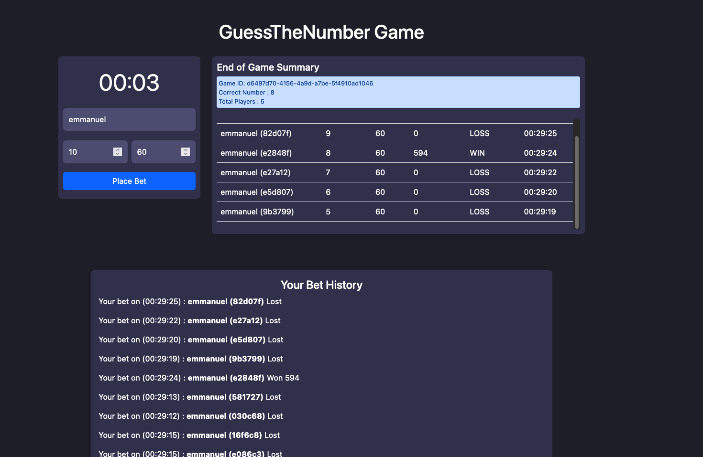

# GuessTheNumber Game

### Overview

A guess the number game using WebSocket communication in SpringBoot. The application
recursively starts a game session and allows players to place a bet in the active game
within a specific time bound (10 seconds). After the game time has elapsed, that is, the
time allowed to place bets, the application generates a random number and awards all bets
that matches the number it generates.

### Core functionalities

- The server start a game round recursively and gives 10 seconds for players to place a bet
- After the time elapse, every play receives a feedback from the game and a summary as seen above
- Players who WON in the round are given a feedback and awarded 9.9 times the stake placed in the bet
- Players who LOST are given a feedback of their loss
- New game rounds are started immediately after the previous game ends

## Install

#### Installation Requirements

- Java 11 or above
- Gradle
- Spring Boot

#### Steps

- Clone the repository
- Load the dependencies `./gradlew clean`
- Run the application `./gradlew bootRun`

The application runs on port `:8080` therefore, you can access its user interface on http://localhost:8080

## Testing

Unit and integration tests were added to the implementation with a coverage of over 80%. Report information can
be found in the **reports** folder.

#### Running Tests

`./gradlew test`

Tests take about 25s to complete

### Side Notes

- The test case `fivePlayerSuccessfullyPlacesBetForActiveGameAndGotFeedback` can be a bottleneck due to its wait time
  and proper mocking can be done to improve this so that scheduling does not need to happen. Nevertheless, it provides
  a good process of simulate an actual game round at this point
- Currencies were not catered for in the betting process, this can be considered as an improvement
- Improved security can be done, to ensure unauthorised access is restricted in communication with the service
- Several improvements can be done for the UI/UX to ensure that the game process is easier from a customer's perspective
- Convert all JavaScript functions to non-blocking functions using Promise